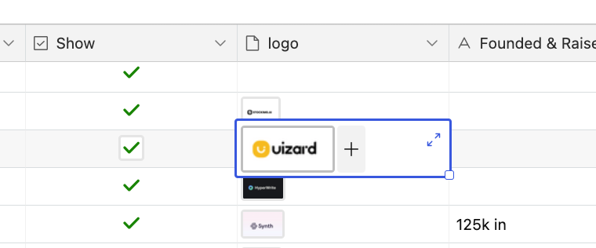
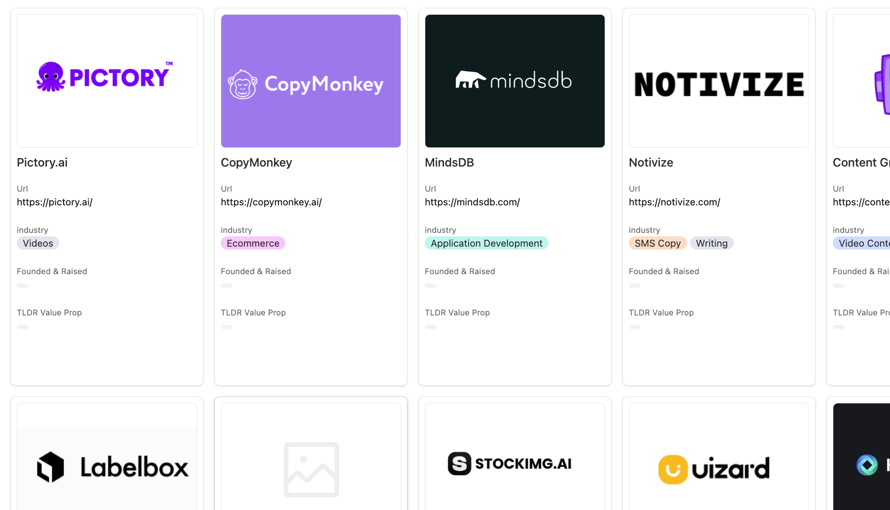

# Github as a CDN?


Low-code cookbook that uses GitHub and Twicpics as an image CDN. Very experimental. This is a block of code that
provides approaches to rethinking the standard AWS S3+CloudFront CDN. The goal is to rethink how these two tools
can be used together to get a code-centric approach to tools with other expected uses.

[Read the full blog](https://stephansmith.solutions/articles/github_as_a_cdn/)

### Tooling

__1. Github__ - This site!? ;) Expected us is code. But. It does other stuff. Like pages. So hosting static content is not that different from what a CDN does.

__2. TwicPics.com__ - Content Proxy. These guys do a lot of interesting stuff, but the one I am using here
is the ability to proxy one path to another path.

### Setup & Environment Variables
So you are going to need to clone this repo. And then edit the `.env` file to use our values. This code
will not work without these values.

```
AIRTABLE_API_KEY=
AIRTABLE_BASE_ID=
AIRTABLE_TABLE_NAME=

GITHUB_PERSONAL_ACCESS_TOKEN=
```

### AirTable
So AirTable is a 'spreadsheet with rockets'. It makes collecting and thinking about data super easy. Their
grid options make it super formattable. But at some point, I want to do more with the data. So
I store the `attachments` in a file called `logo`. I can use these images in the AirTable solution.



<i style="font-size: 10px; color: #DFDFDF;">(Screenshot from Airtable Grid view of an 'attachment' field')</i>



<i style="font-size: 10px; color: #DFDFDF;">(Screenshot from Airtable Gallery using the attachment field.')</i>

### GitHub
This site!? :) Expected us is code. But. It does other stuff. Like pages. So hosting static content is not that different from what a CDN does.

Since public repos are free, I don't really care who can see the files. For this project, I set up
a different repo because if this works as I hope, I will be drop-in blocks of images into different
folders.